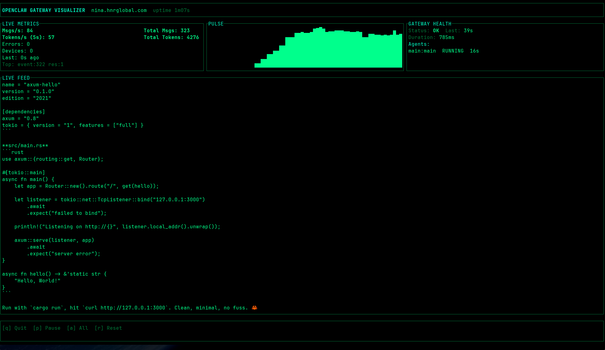

# OpenClaw Gateway Visualizer

Cyberpunk TUI for monitoring OpenClaw gateway traffic in real time.



## Quick start

```sh
cargo run -- --gateway wss://your-gateway --token YOUR_TOKEN
```

Use demo data without a gateway:

```sh
cargo run -- --demo
```

Read newline-delimited events from stdin:

```sh
tail -f events.ndjson | cargo run -- --stdin
```

## Configuration

Environment variables are read from `.env` and the process environment. CLI flags override env values.

| Variable | Purpose |
| --- | --- |
| `openclaw-endpoint` / `OPENCLAW_ENDPOINT` | WebSocket gateway URL (default `ws://127.0.0.1:9001`) |
| `openclaw-token` / `OPENCLAW_TOKEN` / `openclaw-gateway-token` / `OPENCLAW_GATEWAY_TOKEN` | Auth token for the gateway |
| `openclaw-insecure-tls` / `OPENCLAW_INSECURE_TLS` | Allow invalid TLS certificates (`true`/`false`) |

## CLI flags

- `--gateway` WebSocket gateway URL
- `--token` Auth token for the gateway
- `--insecure-tls` Allow invalid TLS certificates (self-signed)
- `--debug` Echo connection status to stderr
- `--stdin` Read newline-delimited events from stdin
- `--demo` Run with synthetic traffic

## Controls

- `q` Quit
- `p` Pause
- `a` Toggle all messages
- `r` Reset session stats

## Build

```sh
cargo build --release
```
